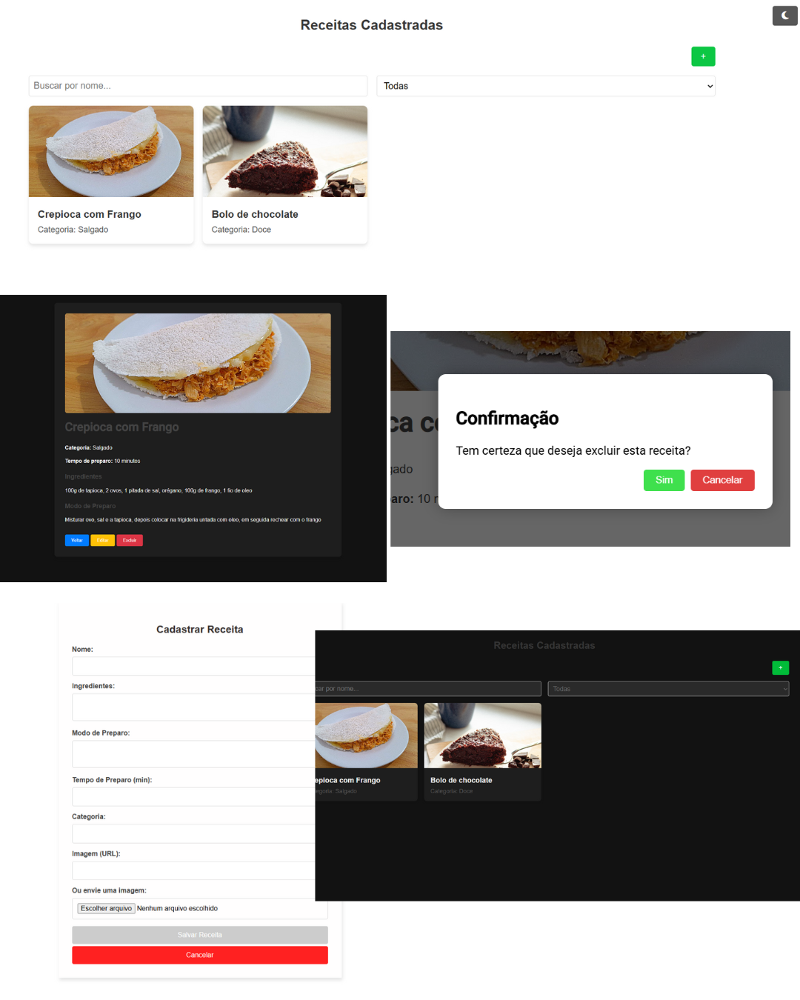
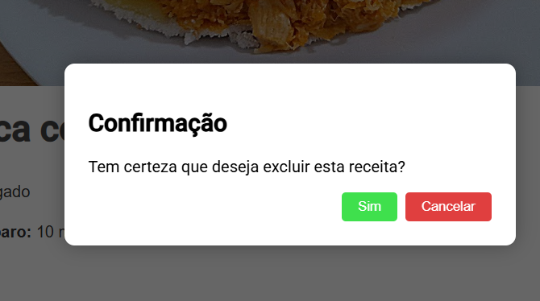
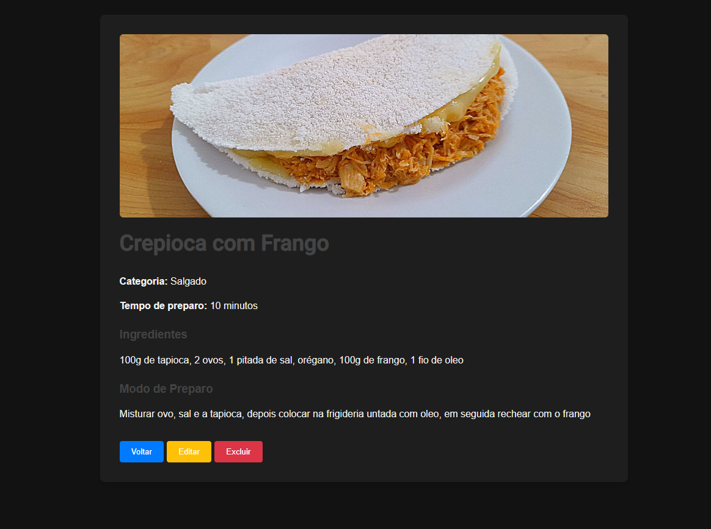

# 📖 Receitas Web

Um aplicativo web para **cadastrar, visualizar, editar e excluir receitas culinárias**, com suporte a **modo escuro**, **upload de imagens** e **armazenamento local**. Desenvolvido com ❤️ usando **Angular 20 (standalone components)**.

 <!-- Coloque aqui uma imagem geral da aplicação -->

---

## 🚀 Funcionalidades

- 📋 Cadastro de receitas com imagem e categoria  
- 🔍 Listagem com **filtro por nome** e **categoria**  
- 🖼️ Upload de imagem **via URL ou arquivo local**
- 🌙 **Modo escuro** estilizado  
- ✏️ Edição de receitas  
- 🗑️ Exclusão com confirmação via modal  
- 💾 Armazenamento com `localStorage`

---

## 🧑‍🍳 Prints da aplicação

### 🌅 Tema Claro

 | Formulário de Cadastro | Modals  |
------------------------|------------------------|
|  | |

### 🌙 Tema Escuro

| Visualização Detalhada | 
|------------------------|
|  |

---

## ⚙️ Como rodar o projeto

### 🔧 Pré-requisitos

- [Node.js](https://nodejs.org/) v18+  
- [Angular CLI](https://angular.io/cli) (v16+)

### 📦 Instalação

1. **Clone o repositório:**

```bash
git clone https://github.com/gabrielymorais/receitas-app.git
cd receitas-app
```
### 📦 Instalação de Dependencias
```bash
npm install
```

### ⚙️ Rode o Projeto
```bash
ng serve
```

## 📁 Estrutura de Pastas

```bash
📁src/
├── 📁app/
│   ├── 📁modal/       # Modal reutilizável para confirmações
│   │   ├── modal.ts
│   │   └── modal.html
│   ├── 📁recipe-detail/        # Tela de visualização detalhada da receita
│   │   ├── recipe-detail.ts
│   │   └── recipe-detail.html
│   ├── 📁recipe-form/          # Tela de cadastro e edição de receitas
│   │   ├── recipe-form.ts
│   │   └── recipe-form.html
│   ├── 📁recipes-list/         # Tela de listagem de todas as receitas
│   │   ├── recipes-list.ts
│   │   └── recipes-list.html
│   ├── app.config.ts         # Arquivo de configuração principal com rotas
│   └── app.ts                # Componente raiz da aplicação
├── 📁assets/                   # Recursos estáticos (imagens, ícones, etc)
├── index.html                # HTML principal da aplicação
└── styles.css                # Estilos globais da aplicação
```


## 🛠️ Tecnologias Usadas

| Tecnologia            | Descrição                                                                 |
|------------------------|---------------------------------------------------------------------------|
|  | Framework principal para criação da SPA |
|  | Linguagem com tipagem estática utilizada no projeto |
|  | Marcação das páginas |
|  | Estilização moderna e responsiva |
|  | Armazenamento local das receitas no navegador |
|  | Utilização do novo padrão de componentes standalone |
| 🌓 Modo Dark/Light    | Alternância de tema utilizando `ngClass` com estilos dinâmicos             |
| 💬 Modal Customizado  | Modal de confirmação feito artesanalmente (sem dependências externas)      |


## 🎥 Demonstração em Vídeo

Confira no vídeo abaixo como a aplicação funciona na prática:

> 🔗 Clique [aqui para assistir diretamente no YouTube](https://youtu.be/atSxz8aOEKI)

---


